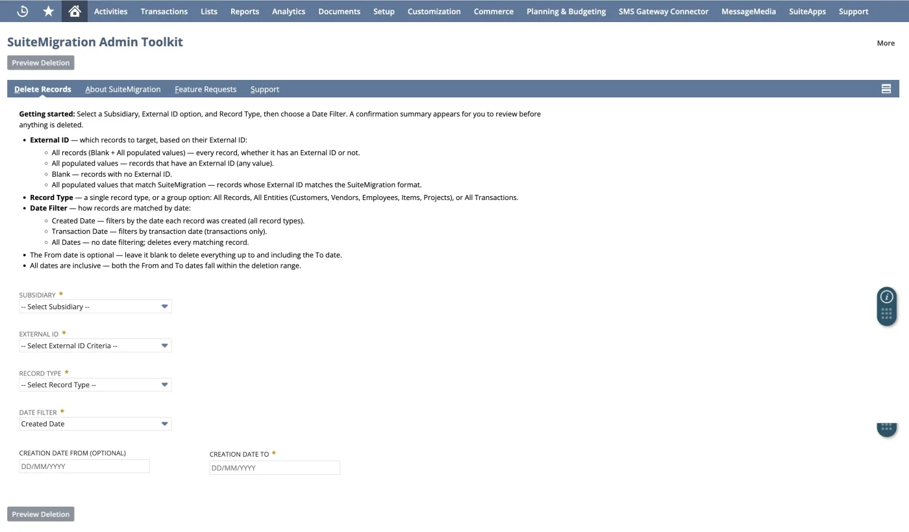
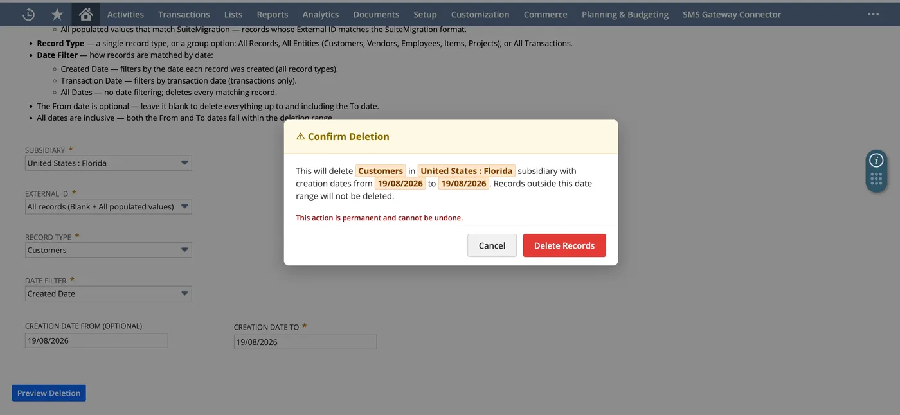
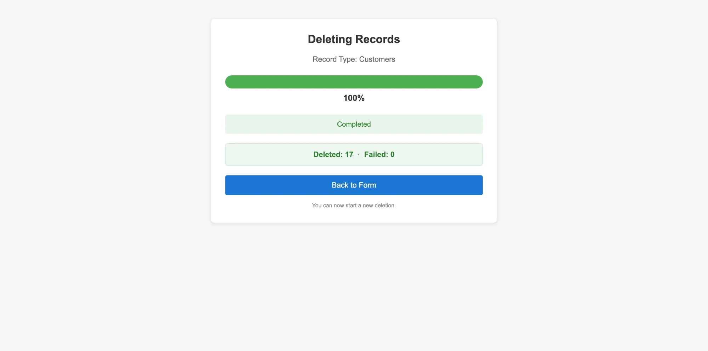

# SuiteMigration Admin Toolkit

A free NetSuite utility for Administrators and Consultants that deletes records in bulk — useful when re-running a migration, clearing down a Sandbox, or removing test data from an account.

Built and published by [SuiteMigration](https://suitemigration.com).

> ⚠️ **Deletions are permanent and cannot be undone.** Test in a Sandbox account before running in Production.

---

## What it does

- Delete by **subsidiary**, **record type** and **date range**
- Target records by **External ID** — all, populated, blank, or matching the SuiteMigration format
- Delete a single record type, or a group (**All Records**, **All Entities**, **All Transactions**)
- **Preview before deleting** — a confirmation modal shows exactly what will be removed
- **Live progress** — real record counts as they are deleted, with per-type deleted/failed totals

---

## What it looks like

Select a subsidiary, an External ID option, a record type and a date filter:



Nothing is deleted until you confirm. The summary spells out exactly what will be
removed:



Progress is reported as the deletion runs, with deleted and failed totals:



---

## How it compares

A saved search finds records — it cannot delete them. NetSuite's native bulk
delete is Mass Update, and its delete actions cover activities, cases, files,
reports and web site redirects. There is no Mass Update that deletes
transactions or entities.

That is the gap this toolkit fills.

| | Admin Toolkit | Saved Search + Mass Update |
|---|:---:|:---:|
| Find records by subsidiary, date and External ID | ✅ | ✅ |
| Review the list before anything is deleted | ✅ | ✅ |
| Delete entities — customers, vendors, employees, items, projects | ✅ | ❌ |
| Delete all 17 transaction types — invoices, credit memos, customer payments, vendor bills, vendor payments, purchase orders, cash sales, deposits, checks, transfers, journal entries and more | ✅ | ❌ |
| All six item subtypes in one selection — inventory, non-inventory, service, assembly, kit and group | ✅ | ❌ |
| Delete events, tasks, cases, files, reports | ❌ | ✅ |
| Target only the records a SuiteMigration push created | ✅ | ❌ |
| Delete multiple record types in one run | ✅ | ❌ |
| Deletion order handled for you | ✅ | ❌ |
| Sub-customers and their contacts removed first, children before parents | ✅ | ❌ |
| Live deleted/failed counts as it runs | ✅ | ❌ |
| Save the criteria and re-run them later | ❌ | ✅ |
| No installation required | ❌ | ✅ |

The two are complementary. For the entities and transactions a migration leaves
behind, NetSuite offers no bulk option. For activities and files, use Mass
Update — it is native and there is nothing to install.

Deletion order is the other half of the problem. NetSuite will not delete a
record that something else depends on — a customer with invoices, a bill with a
payment against it — so records have to be removed in the right sequence. The
toolkit clears all 22 record types in one pass, in dependency order.

---

## Repository structure

```
.
├── docs/
│   └── DEPLOYMENT_GUIDE.md    Setup instructions, script IDs and parameters
└── scripts/
    ├── SuiteMigration_AdminToolkit_SuiteLet.js    Suitelet — the user interface
    └── SuiteMigration_AdminToolkit_MapReduce.js   Map/Reduce — performs the deletion
```

---

## Installation

Upload both files from `scripts/` to the same File Cabinet folder
(*Documents > Files > SuiteScripts*), then create the script records.

Full instructions, including the required script and parameter IDs:
**[docs/DEPLOYMENT_GUIDE.md](docs/DEPLOYMENT_GUIDE.md)**

---

## Documentation

**[Support article](https://support.suitemigration.com/deletion-scripts/)** — setup walkthrough
on the SuiteMigration support site.

---

## Licence

Provided under the **SuiteMigration Free Utility License** — see [LICENSE](LICENSE).

Provided "AS IS" without warranty of any kind.
